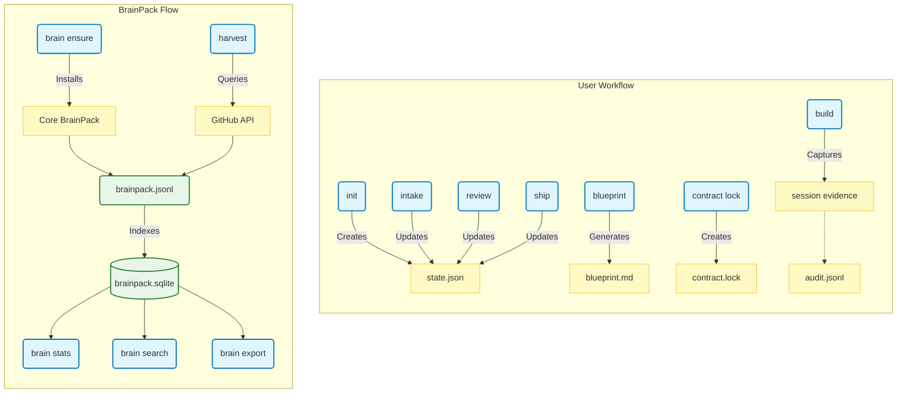

# 📁 Data Layout

Understanding where VibeAnvil stores data on your system.

---

## 📂 Overview

VibeAnvil stores data in two locations:

| Location | Purpose | Scope |
|----------|---------|-------|
| `.vibeanvil/` | Project workspace | Per-project |
| Cache directory | BrainPack storage | User-level (shared) |

---

## 🗂️ Workspace Structure (`.vibeanvil/`)

Created in your project directory when you run `vibeanvil init`.

```
.vibeanvil/
├── state.json              # Current workflow state
├── .gitignore              # Ignores sensitive files
│
├── contracts/              # Contract files
│   ├── contract.json       # Active contract
│   └── contract.lock       # Locked contract (immutable)
│
├── blueprints/             # Generated blueprints
│   └── blueprint.md        # Current blueprint
│
├── logs/                   # Audit trail
│   └── audit.jsonl         # JSONL audit log
│
├── sessions/               # Build sessions
│   └── <session-id>/       # Session directory
│       ├── session.json    # Session metadata
│       ├── evidence/       # Captured evidence
│       │   ├── patch.diff  # Git diffs
│       │   ├── test.log    # Test output
│       │   └── lint.log    # Lint output
│       └── capsules/       # Guardrails change capsules
│           └── <capsule-id>/
│               ├── meta.json   # Risk level, reasons, approval status
│               ├── patch.diff  # Change diff
│               └── approve.json # Approval token (optional)
│
└── cache/                  # Local cache
    └── ...                 # Temporary files
```

### File Descriptions

| File | Description |
|------|-------------|
| `state.json` | Tracks current workflow state (Init → Shipped) + guardrails config |
| `contracts/contract.json` | Your project contract with requirements |
| `contracts/contract.lock` | Locked contract - cannot be modified |
| `logs/audit.jsonl` | JSONL log of all commands and events |
| `sessions/<id>/evidence/` | Evidence captured during builds |
| `sessions/<id>/capsules/` | Guardrails change capsules with diffs and approvals |

### What Gets Git-Ignored

The generated `.gitignore` excludes:
- `logs/` - Audit logs may contain sensitive paths
- `sessions/*/evidence/` - Evidence may contain code diffs
- `cache/` - Temporary files
- `*.lock` - Lock files

---

## 🧠 BrainPack Storage (Cache Directory)

BrainPack uses the system cache directory for persistent storage across projects.

### Paths by Operating System

| OS | Cache Path |
|----|------------|
| **Windows** | `%LOCALAPPDATA%\vibeanvil\brainpack\` |
| | Example: `C:\Users\You\AppData\Local\vibeanvil\brainpack\` |
| **macOS** | `~/Library/Caches/vibeanvil/brainpack/` |
| **Linux** | `~/.cache/vibeanvil/brainpack/` |

### BrainPack Structure

```
<cache-dir>/vibeanvil/brainpack/
├── brainpack.jsonl         # All records in JSONL format
└── brainpack.sqlite        # SQLite database with FTS5 index
```

### File Descriptions

| File | Description |
|------|-------------|
| `brainpack.jsonl` | Append-only log of all harvested content |
| `brainpack.sqlite` | SQLite database with full-text search index |

### SQLite Tables

```
sources           # Metadata about harvested sources (anonymized)
brain_chunks      # Individual searchable chunks
chunks_fts        # FTS5 virtual table for search
```

---

## 🔄 Data Flow Diagram



---

## 🔒 Privacy Notes

### What IS Stored
- Code content (chunked for search)
- Anonymized source IDs (SHA-256 hashes)
- Language/license metadata
- Tags and signals

### What is NOT Stored
- Repository URLs or names
- Owner/author information
- Commit messages
- Issue/PR content
- Any personally identifiable information

---

## 🧹 Cleaning Up

### Reset Workspace
```bash
# Remove workspace (keeps BrainPack)
rm -rf .vibeanvil

# Reinitialize
vibeanvil init
```

### Clear BrainPack
```bash
# Windows
rd /s /q %LOCALAPPDATA%\vibeanvil

# macOS
rm -rf ~/Library/Caches/vibeanvil

# Linux
rm -rf ~/.cache/vibeanvil
```

### Uninstall Everything
```bash
# Use the uninstall script
# Windows:
irm https://raw.githubusercontent.com/ThanhNguyxn/vibeanvil/main/uninstall.ps1 | iex

# macOS/Linux:
curl -fsSL https://raw.githubusercontent.com/ThanhNguyxn/vibeanvil/main/uninstall.sh | bash
```

---

## 💡 Tips

1. **Backup contracts before force-init**: `cp .vibeanvil/contracts/contract.json ~/backup/`
2. **Share BrainPack across machines**: Export with `brain export jsonl` and import
3. **Check storage usage**: `vibeanvil brain stats` shows JSONL and SQLite sizes

---

Made with ❤️ by the VibeAnvil team
