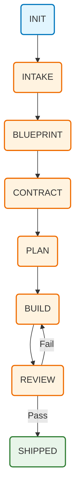

# 📋 Workflow Guide

Master the VibeAnvil workflow from idea to shipped product.

---

## 🔄 Workflow States



---

## 📁 State: INIT

**Purpose:** Set up the VibeAnvil workspace

**Command:**
```bash
vibeanvil init [--force]
```

**Prerequisites:** None

**What happens:**
- Creates `.vibeanvil/` directory structure
- Initializes `state.json` to `Init` state
- Sets up audit logging in `.vibeanvil/logs/`
- Prepares evidence collection in `.vibeanvil/sessions/`
- Creates `.vibeanvil/.gitignore`

**Outputs:**
- `.vibeanvil/` directory
- `.vibeanvil/state.json`
- `.vibeanvil/logs/audit.jsonl`

> **Note:** BrainPack data is stored in your OS cache directory. Run `vibeanvil brain stats` to see the location.

---

## 📝 State: INTAKE

**Purpose:** Capture requirements and project goals

**Command:**
```bash
vibeanvil intake -m "Your project requirements here"
```

**Prerequisites:** State must be `Init`

**What happens:**
- Updates `state.json` to `IntakeCaptured`
- Records requirements in state
- Logs intake event to audit trail

**Best practices:**

✅ **Good intake:**
```bash
vibeanvil intake -m "Build a REST API with:
- User authentication (JWT)
- CRUD for posts
- Rate limiting
- PostgreSQL database
- Docker deployment"
```

❌ **Bad intake:**
```bash
vibeanvil intake -m "Build an app"
```

**Tips:**
- Be specific about features
- Include technical constraints
- Mention preferred technologies
- Define success criteria

---

## 📐 State: BLUEPRINT

**Purpose:** Create a structured plan from intake

**Command:**
```bash
# Auto-generate from intake
vibeanvil blueprint --auto

# Or manually create
vibeanvil blueprint
```

**Prerequisites:** State must be `IntakeCaptured`

**What happens:**
- Updates `state.json` to `BlueprintGenerated`
- Creates `blueprint.md` from intake requirements
- Uses AI to structure the plan (if --auto)

**Outputs:**
- `blueprint.md` file

**Blueprint structure:**
```markdown
# Project Blueprint

## Overview
[Generated from intake]

## Components
1. API Layer
2. Database Layer
3. Auth Layer

## Technical Stack
- Language: Rust
- Framework: Axum
- Database: PostgreSQL

## Milestones
[ ] MVP
[ ] Auth integration
[ ] Deployment
```

---

## 📜 State: CONTRACT

**Purpose:** Lock down the specifications

**Prerequisites:** State must be `BlueprintGenerated`

**What happens:**
- `create`: Generates `contract.json` from blueprint
- `validate`: Checks contract schema and requirements
- `lock`: Hashes contract, updates state to `ContractLocked`

**Outputs:**
- `contract.json` (The Source of Truth)
- `state.json` updated with `spec_hash`

### Create Contract
```bash
vibeanvil contract create
```

### Validate Contract
```bash
vibeanvil contract validate
```

Checks:
- ✅ All required fields present
- ✅ Blueprint consistency
- ✅ Intake alignment
- ✅ No conflicts

### Lock Contract ⚠️
```bash
vibeanvil contract lock
```

> ⚠️ **WARNING:** Once locked, the contract **cannot be changed!**
> This ensures commit to the agreed specifications.

---

## 📋 State: PLAN

**Purpose:** Create implementation plan

```bash
vibeanvil plan --provider claude-code
# or
vibeanvil plan --provider human
```

**Prerequisites:** State must be `ContractLocked`

**What happens:**
- 🧠 **Smart Context**: Scans your codebase to create a "Repository Map" (types, functions, signatures).
- AI analyzes contract & repo map.
- Generates step-by-step implementation.
- Creates task breakdown.
- Estimates complexity.
- Updates `state.json` to `Planned`.

**Outputs:**
- `implementation_plan.md`

**Output:**
```
📋 Implementation Plan Generated

  1. [ ] Set up project structure
  2. [ ] Configure database schema
  3. [ ] Implement auth middleware
  4. [ ] Create API endpoints
  5. [ ] Add tests
  6. [ ] Configure Docker
```

---

## 🔨 State: BUILD

**Purpose:** Execute the implementation

**Prerequisites:** State must be `Planned`

**Outputs:**
- Source code changes
- `state.json` updated to `Built` (on complete)

### Manual Build
```bash
vibeanvil build manual start
# ... do your coding ...
vibeanvil build manual evidence  # capture evidence
vibeanvil build manual complete
```

**Interactive Auto-Commit 🌊**
When you run `complete`, VibeAnvil:
1. Analyzes your changes.
2. "Dreams up" a Conventional Commit message.
3. Asks you to **Confirm**, **Edit**, or **Cancel**.
4. Commits for you if confirmed.

### Auto Build
```bash
vibeanvil build auto --provider claude-code --evidence
```

Single-shot AI-assisted build.

### Iterate Build ⭐
```bash
vibeanvil build iterate --max 5 --evidence --provider human
```

Loop that:
1. 🔨 Builds code
2. 🧪 Runs tests
3. 🔍 Runs lints
4. 🔄 Fixes issues
5. Repeats until success or max iterations

**Example output:**
```
🔄 Iterate Build Mode
══════════════════════════════════════

[1/5] Building...
      Tests:  ❌ 3 failures
      Lint:   ⚠️  5 warnings
      → Fixing issues...

[2/5] Building...
      Tests:  ❌ 1 failure
      Lint:   ✓ Clean
      → Fixing issues...

[3/5] Building...
      Tests:  ✓ All passing
      Lint:   ✓ Clean
      
✓ Build complete after 3 iterations
```

### 🛡️ Guardrails (Change Gate)

When Guardrails are enabled, each AI-generated change is analyzed and gated:

| Risk Level | Action |
|------------|--------|
| **A** (Safe) | Auto-approved (docs, comments) |
| **B** (Logic) | Requires approval (code changes) |
| **C** (High-Impact) | Requires approval + impact analysis (API, deps, security) |

**Enable guardrails** in `state.json`:
```json
{
  "guardrails": {
    "enabled": true,
    "mode": "normal"
  }
}
```

See [docs/guardrails.md](guardrails.md) for configuration details.

---

## 🤖 Choosing a Provider

VibeAnvil supports multiple AI providers. See [docs/providers.md](providers.md) for full details.

| Provider | Best For |
|----------|----------|
| `human` | GitHub Copilot, Cursor, VS Code Chat |
| `claude-code` | Fully automated CLI workflows |
| `command` | External CLI agents (Aider, etc.) |
| `patch` | API-based LLMs returning diffs |

---

## 👀 State: REVIEW

**Purpose:** Review and approve the build

### Start Review
```bash
vibeanvil review start
```

**Prerequisites:** State must be `Built`

**What happens:**
- Updates state to `Reviewed` (initially)
- Displays summary of changes and evidence

**Outputs:**
- Review status in `state.json`

### Check Changes
Review the generated code, tests, and evidence.

### Pass or Fail
```bash
# If satisfied
vibeanvil review pass

# If needs changes
vibeanvil review fail
```

On fail, you return to BUILD state to fix issues.

---

## 🚀 State: SHIPPED

**Purpose:** Mark project as complete

```bash
vibeanvil ship --tag v1.0.0 -m "Initial release"
```

**Prerequisites:** State must be `Reviewed` (passed)

**What happens:**
- Creates final snapshot in `.vibeanvil/sessions/`
- Generates ship manifest
- Archives evidence
- Writes audit entry
- Updates state to `Shipped`

**Outputs:**
- `ship_manifest.json`
- Final snapshot directory

**Output:**
```
🚀 Project Shipped!
══════════════════════════════════════

  Version:    v1.0.0
  Message:    Initial release
  Hash:       abc123...
  Timestamp:  2024-12-24T18:00:00Z
  
  Evidence:   12 files captured
  Audit:      156 entries logged
  
Congratulations! 🎉
```

---

## 🔀 State Transitions

| From | To | Command |
|------|----|---------|
| (none) | init | `vibeanvil init` |
| init | intake | `vibeanvil intake` |
| intake | blueprint | `vibeanvil blueprint` |
| blueprint | contract | `vibeanvil contract create` |
| contract | plan | `vibeanvil contract lock` → `vibeanvil plan` |
| plan | build | `vibeanvil build` |
| build | review | `vibeanvil review start` |
| review | shipped | `vibeanvil review pass` → `vibeanvil ship` |
| review | build | `vibeanvil review fail` |

---

## 🔒 Security Features

VibeAnvil includes built-in security hardening:

- **Path Traversal Protection** - All file operations validated
- **Filename Sanitization** - Unsafe characters blocked
- **Privacy-First** - Source IDs anonymized (SHA-256)
- **Secret Redaction** - Credentials auto-removed from logs

See [Security Guide](security.md) for details.

---

## 🔬 Refinement Phase

Before planning, clarify ambiguous requirements:

**Built-in questions by category:**
- **Scope** - MVP features, deadlines, deferrals
- **Tech** - Language, integrations, libraries
- **UX** - Users, platforms, accessibility
- **Security** - Data protection, compliance, auth

Location: `src/contract/refinement.rs`

---

## 📜 SLSA Provenance

VibeAnvil generates SLSA-style provenance for supply chain security:

```rust
use crate::build::provenance::Provenance;

let mut prov = Provenance::new(contract_hash, session_id);
prov.add_dependency("file:///src/main.rs", sha256);
prov.finish();
```

**Captures:**
- Contract hash
- Build start/end time
- Session ID
- Resolved dependencies with SHA-256

---

---

## 🆕 Enhanced Workflow Commands

VibeAnvil now includes advanced workflow features inspired by Aider and GitHub's Spec-Kit:

### 🏛️ Constitution - Establish Project Principles

Set up governing principles that guide all development:

```bash
# Create constitution interactively
vibeanvil constitution

# With specific guidelines
vibeanvil constitution --guidelines "Focus on code quality, 100% test coverage, TDD approach"

# View existing constitution
vibeanvil constitution --view
```

**What it creates:** `.vibeanvil/constitution.md` with principles for:
- Code quality standards
- Testing requirements
- Architecture guidelines
- Security requirements
- Review standards

---

### ❓ Clarify - Interactive Q&A

Identify gaps in requirements before planning:

```bash
vibeanvil clarify --provider claude-code
```

**What it does:**
- Analyzes your intake and contract
- Generates clarifying questions
- Identifies ambiguous requirements
- Saves questions to `.vibeanvil/clarify.md`

---

### 📋 Tasks - Break Down the Plan

Convert implementation plan into actionable tasks:

```bash
# Generate tasks
vibeanvil tasks --provider claude-code

# Regenerate tasks
vibeanvil tasks --regenerate

# Mark a task as done
vibeanvil tasks --done 1.2
```

**Task format:**
```
[○] [1] Setup project [small]
    └─ depends on: none
[○] [2] Implement core [large]
    └─ depends on: 1
[✓] [3] Add tests [medium]
    └─ depends on: 2
```

---

### 🔍 Analyze - Cross-Artifact Consistency

Check all artifacts for consistency and coverage:

```bash
vibeanvil analyze --provider claude-code
```

**What it checks:**
- Intake ↔ Contract alignment
- Contract ↔ Plan coverage
- Plan ↔ Tasks mapping
- Missing edge cases
- Risk assessment
- Overall readiness score (0-100)

---

### ⚡ Implement - Execute Tasks

Automatically implement tasks from the task list:

```bash
# Implement next task
vibeanvil implement --provider claude-code

# Implement specific task
vibeanvil implement --task 1.2

# Implement all remaining tasks
vibeanvil implement --all

# Dry run (see what would be done)
vibeanvil implement --dry-run
```

---

### 🖥️ Run - Execute Commands

Run commands and optionally share output with AI:

```bash
# Run a command
vibeanvil run "npm test"

# Capture output as evidence
vibeanvil run "cargo build" --capture

# Share output with AI for analysis (useful for errors)
vibeanvil run "cargo test" --share
```

---

### 🧪 Test - Run Tests with Auto-Fix

```bash
# Auto-detect and run tests
vibeanvil test

# Custom test command
vibeanvil test --cmd "pytest -v"

# Auto-fix failing tests
vibeanvil test --fix
```

---

### 🔍 Lint - Run Linter with Auto-Fix

```bash
# Auto-detect and run lint
vibeanvil lint

# Custom lint command
vibeanvil lint --cmd "eslint ."

# Auto-fix lint errors
vibeanvil lint --fix
```

---

### 🗺️ Map - Repository Map

Generate a codebase map for AI context:

```bash
vibeanvil map

# With token limit
vibeanvil map --max-tokens 4000
```

**Outputs:**
- `.vibeanvil/repomap.json` - Full structured map
- `.vibeanvil/repomap.md` - Compact context for AI

---

### 💬 Chat - Multi-Mode Conversations

Chat with AI in different modes (inspired by Aider):

```bash
# Ask questions without making changes
vibeanvil chat ask "What does this function do?"

# Make code changes (default)
vibeanvil chat code "Add error handling to this function"

# High-level architecture proposals
vibeanvil chat architect "How should I structure the auth module?"

# Get help with VibeAnvil
vibeanvil chat help "How do I use guardrails?"
```

**Chat Modes:**
| Mode | Purpose |
|------|---------|
| `ask` | Discuss code without changes |
| `code` | Make code changes |
| `architect` | High-level design proposals |
| `help` | VibeAnvil usage help |

---

## 📍 Where Data Lives

| Location | Path | Scope |
|----------|------|-------|
| Workspace | `.vibeanvil/` (in project) | Per-project |
| BrainPack (Linux) | `~/.cache/vibeanvil/brainpack/` | User-level |
| BrainPack (macOS) | `~/Library/Caches/vibeanvil/brainpack/` | User-level |
| BrainPack (Windows) | `%LOCALAPPDATA%\vibeanvil\brainpack\` | User-level |

See [docs/data-layout.md](data-layout.md) for complete details.

---

## 💖 Support VibeAnvil

<p align="center">
  <a href="https://github.com/sponsors/ThanhNguyxn">
    
  </a>
  <a href="https://buymeacoffee.com/thanhnguyxn">
    
  </a>
</p>

---

Made with ❤️ by the VibeAnvil team
